# CLASSIFICATION: IMBALANCED DATA 

# CreditCard Fraud Detection

## Overview

* **Classification** project on **Imbalanced dataset**
* Credit card dataset from Kaggle which has about 1.5 million rows
* Sampling 10% of the original dataset
* **Machine Learning Models** 
* Logistic Regression 
* Desision Tree Classification
* Random Forest Classification
* XGBoost Classification

## Visualization

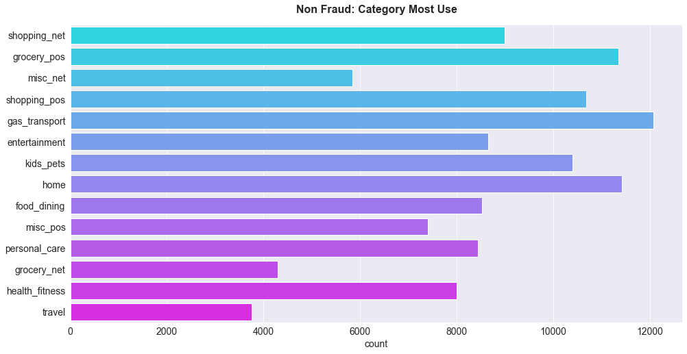

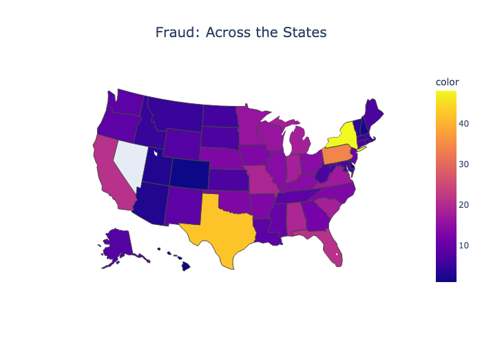

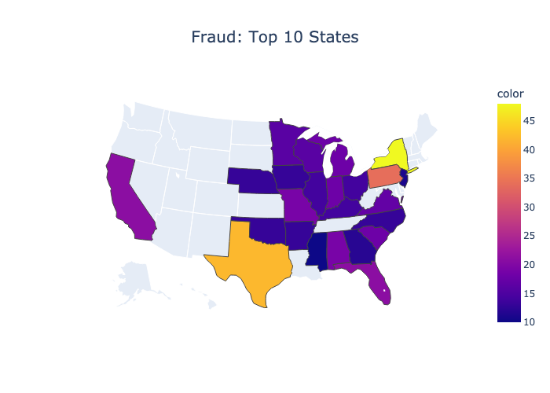

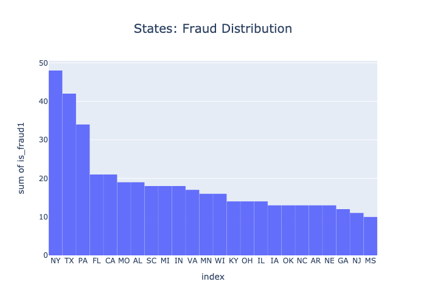

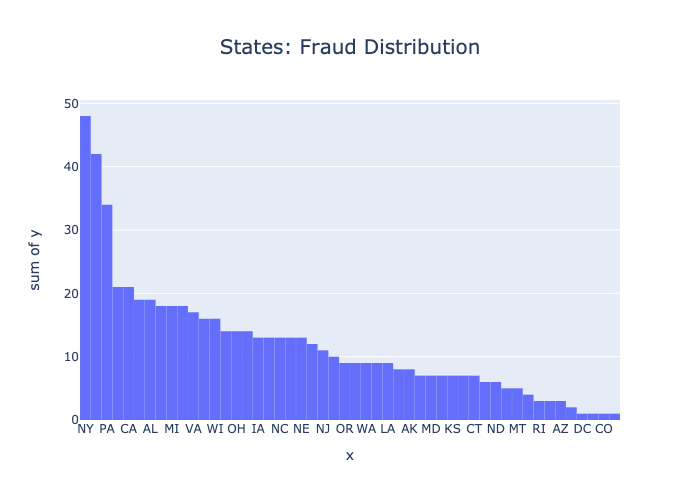

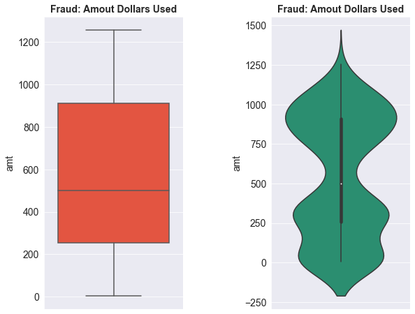

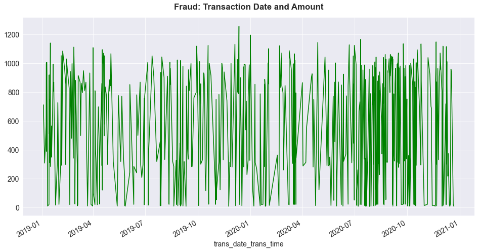

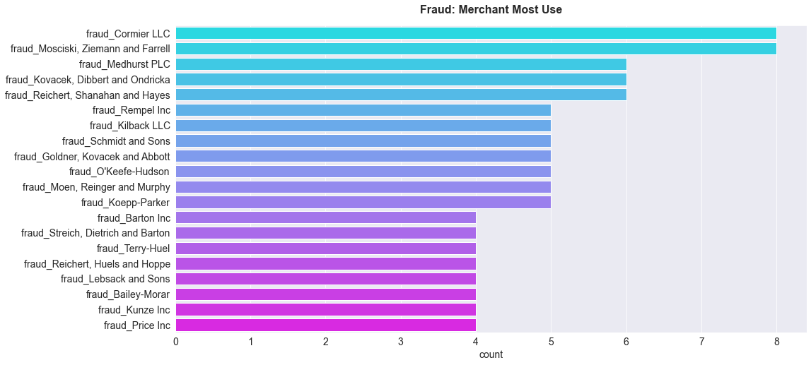

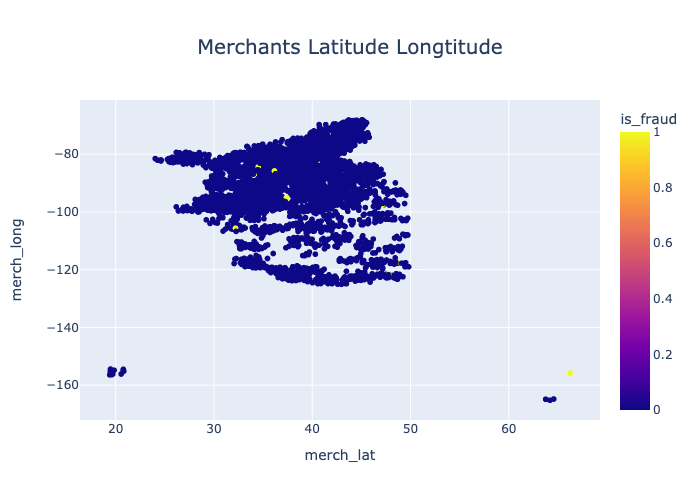

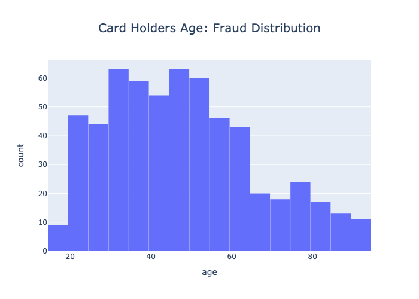

## Logistic Regression

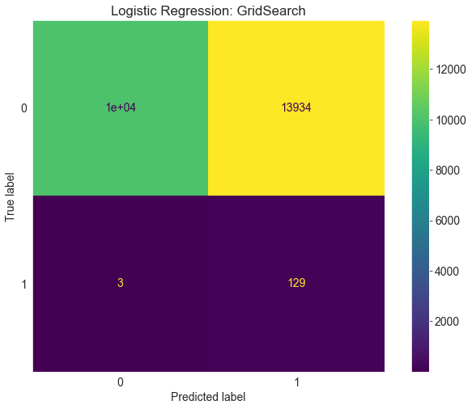

## Decision Tree

## Random Forest

## XGBoost

## Futher Improvement
- Grid Search CV

