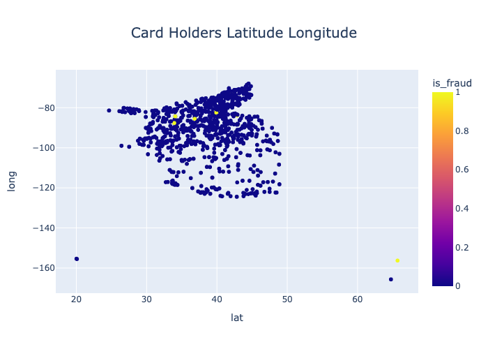

# CLASSIFICATION: IMBALANCED DATA 

# Credit Card Fraud Detection

## Overview

* **Classification** project on **Imbalanced dataset**
* Credit card dataset from Kaggle, which has about 1.5 million rows
* Sampling 10% of the original dataset
* **Machine Learning Models** 
* Logistic Regression 
* Decision Tree Classification
* Random Forest Classification
* XGBoost Classification

## Visualization

## Models Prediction
* Total Testing samples are 24,082 transactions
* True Fraud are 132 Transactions
* The rest are legit Transactions

## Logistic Regression
* 132 Frauds walk away: 2 clients get angry for stopping transactions.

* 37 Frauds walk away: 413 clients get angry for stopping transactions.

* 34 Frauds walk away: 1663 clients get angry for stopping transactions.

* 3 Frauds walk away: 13,934 clients get angry for stopping transactions.

## Decision Tree

* 53 Frauds walk away: 29 clients get angry for stopping transactions.

* 54 Frauds walk away: 30 clients get angry for stopping transactions.

* 13 Frauds walk away: 1939 clients get angry for stopping transactions.

## Random Forest

* 64 Frauds walk away: 6 clients get angry for stopping transactions.

* 67 Frauds walk away: 10 clients get angry for stopping transactions.

* 64 Frauds walk away: 8 clients get angry for stopping transactions.

* 34 Frauds walk away: 66 clients get angry for stopping transactions.

## XGBoost

* 50 Frauds walk away: 9 clients get angry for stopping transactions.

* 32 Frauds walk away: 40 clients get angry for stopping transactions.

* 31 Frauds walk away: 61 clients get angry for stopping transactions.

## Futher Improvement
- Grid Search CV

